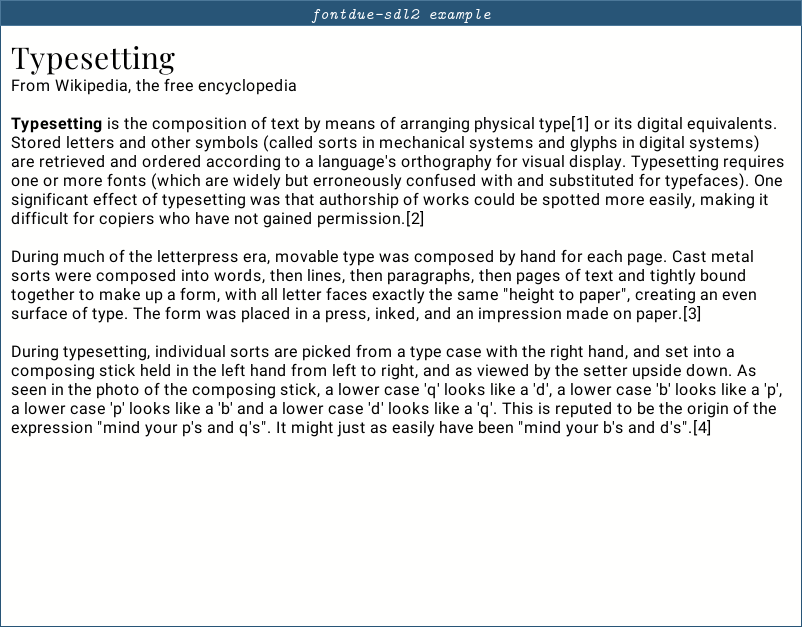

# fontdue-sdl2

A crate for drawing text with [sdl2::render][sdl2::render], using
[fontdue][fontdue] for rasterization. This library is glue-code, all
the good parts are from the aforementioned libraries.

The motivation for this crate is to allow easier, rustier, and better
quality text rendering in projects that use SDL2's render module,
compared to sdl2_ttf.

Note that fontdue is already a "full solution to text rendering", it's
a very application-facing crate. This crate exists so that I don't
need to write a text rendering cache for each SDL2 project I work on,
and that part isn't implemented in fontdue probably because it varies
based on rendering technology. This is a solution for fontdue + SDL2.

## Documentation

Read the docs on [docs.rs][docs].

## Compared to sdl2_ttf

This library draws each glyph as its own quad, from a single gylph
cache texture. This is very fast on modern GPUs, as it can be done in
a single draw call. Per-text-area caching can still be achieved by
rendering this library's results into a render texture.

## Performance and shortcomings

Reserving a spot on the glyph cache texture is currently proportional
to the amount of previously allocated glyphs, so it gets slower over
time. Some ad-hoc testing shows about 20 microseconds per glyph in
release, up to 200 microseconds in debug, for a few paragraphs at
different sizes. This rarely affects overall performance badly
however, since this only needs to be done once per
character/size/color/font combo. But there is still a lot of room for
optimization.

Currently the crate is still a work in progress, so there are a few
missing features:

- The glyph cache texture isn't resized on the fly, the texture is
  always 1024x1024.
- Unused glyphs can't be overwritten, every glyph that gets written
  will exist in the cache forever.

Removing unused glyphs (and detecting them, for that matter) may be
too performance intensive in the end, so I may release a 1.0 after I
implement on-the-fly texture resizing. Manual clearing of the cache
might also be added, though the usefulness of that is questionable, as
you could simply create a new FontTexture for a similar effect.

## Screenshot

This mostly shows off fontdue (the text rasterization) and SDL2 (the
window and rendering), but I think rendering crates should have
screenshots for first impressions. This screenshot was taken of the
[testbed.rs](examples/testbed.rs) example.

## License

This library can be used under the terms of the [MIT license][license].

[sdl2::render]: https://docs.rs/sdl2/0.34.3/sdl2/render/index.html
[fontdue]: https://crates.io/crates/fontdue
[docs]: https://docs.rs/fontdue-sdl2/
[license]: LICENSE.md
